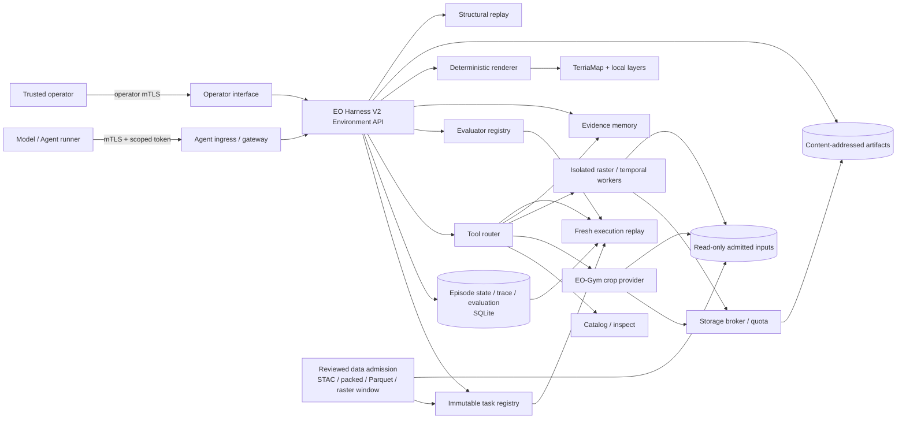

# EO Harness 当前结构框架

更新时间：2026-09-21（阶段性收尾版）

状态：阶段性收尾，等待后续测试通知

权威实现：`a800x4_197_via_vps:/sata/yangm/eo-harness`

分支：`codex/eo-gym-integration`
已验收实现基线（A800 与本地一致）：
`b0ae38005a949b42d37e3765d97637ef7eda91bd`
本地收尾文档提交：见该分支最新提交（A800 未同步，等待恢复通知）

本文是当前结构的仓库内权威摘要。更细的 contract、验收命令和逐项证据
保存在 `docs/` 对应专题文档中；本文不复制那些长文，也不把历史 TODO
继续留在活动计划里。

## 1. 当前定位

EO Harness 不是“把所有遥感数据放到一个网页里”的 GIS，也不是单纯的数据集集合。它当前承担的是一个可评测的遥感 Agent 交互环境：

- 把任务、输入、可调用工具、预算和终止条件固化成 immutable task；
- 把 Agent 的每次 action 转成 typed observation，并记录 append-only trace；
- 把原始影像、派生 raster、evidence、answer 和 metric 用可校验 lineage 连接起来；
- 支持 restart、idempotent retry、structural replay 和 fresh execution replay；
- 用隐藏 reference/evaluator 判断 Agent 是否选对工具、引用了正确证据并给出可支持的结论；
- 用 scoped credential、网络隔离和 fail-closed provider 限制 Agent 的能力边界。

TerriaMap 和 renderer 是人类检查及确定性 rendered observation 的载体，不是 Agent 必须“看见”的唯一环境。Headless tool task 可以完全没有地图状态。

## 2. 总体结构

图中 mTLS、Agent gateway、storage broker、provider 和 replay 通常通过专用 Compose profile 组合；基础 `compose.yaml` 主要承载 Harness API、renderer 和 TerriaMap。外部数据、runtime、数据库、artifact、报告、证书及模型均不进入 Git。

## 3. 核心组件

| 层 | 当前职责 | 主要实现位置 |
| --- | --- | --- |
| Task contract | 固定 prompt、输入引用、action/tool allowlist、预算、answer schema、evaluator 和 metric 权重 | `tasks/`、`harness_api/app/v2/capabilities.py`、`schemas.py` |
| Environment API | `reset → step → observation/state → answer → evaluation`；并发版本、幂等、预算、typed error | `harness_api/app/v2/api.py`、`domain.py`、`store.py` |
| Action / observation | map、tool、evidence、answer action；structural/rendered/artifact observation | `harness_api/app/v2/schemas.py`、`observations.py` |
| Tool execution | 先 reserve transaction，再在事务外调用 provider，最后 finalize；provider 失败不得回退旧结果 | `tool_execution.py`、`tools/` |
| EO-Gym adapter | 将 EO-Gym 作为受限 provider 使用；当前重点是 reviewed image crop，不把上游任意工具直接暴露给 Agent | `eo_gym_bridge.py`、`tools/eo_gym.py` |
| Raster / temporal workers | grid alignment、fixed-policy band math、zonal statistics、temporal select/align；每种能力独立 fail-closed | `raster_bridge.py`、`v2/raster_*.py`、`v2/temporal.py`、`scripts/*worker.py` |
| Artifact and lineage | content-addressed artifact、checksum、task/episode scope、parent lineage、Range read | `v2/artifacts.py`、`artifact_identity.py`、artifact store |
| Evidence | bounds-checked source/artifact evidence；只保存 typed ref，不把大 raster 写入 trace | `v2/evidence.py`、`domain.py` |
| Evidence memory | 跨任务、policy-bound、budgeted search；public projection 与 private provenance 分离 | `v2/evidence_memory.py`、`tools/memory.py` |
| Evaluation | 任务真值、evidence faithfulness、process efficiency、abstention/false-confidence 等 metric | `v2/evaluation.py` 与 benchmark-specific evaluator |
| Replay | structural replay 检查历史一致性；execution replay 用新 provider 重放并重算 artifact/evaluation | `v2/execution_replay.py`、`scripts/replay_episode.py` |
| Agent access | episode-scoped token、task/manifest pin、gateway route allowlist、跨 episode 拒绝 | `agent_credentials.py`、`agent_gateway.py` |
| Control plane | issuance policy、rotate/revoke、certificate binding、hash-chained audit、operator/Agent route separation | `control_plane.py`、mTLS Compose profiles |
| Human inspection | TerriaMap 展示本地 EO layer；renderer 产生固定 viewport 的确定性 PNG | `ui/`、`harness_renderer/`、`config/` |

## 4. 三条主要数据流

### 4.1 数据准入与任务冻结

1. Operator 从 STAC、packed dataset 或 reviewed Parquet path column 选择 bounded sample。
2. Admission 检查 source/license receipt、路径逃逸、symlink、尺寸、格式、hash 和配额。
3. 大影像只按显式 policy 产生 fixed raster window，不提高全局像素上限。
4. 输入以 `AssetRef` / `PixelAssetRef` 登记；标签与 evaluator reference 保持 operator-private。
5. Task pack 固定 task/scenario/assets/evaluator bytes，并由 manifest hash 参与 episode identity。

这一步是 preprocessing，不等同于 Agent interaction，也不等同于语义 benchmark 已成立。

### 4.2 在线 Agent episode

1. Trusted issuer 先通过 operator interface 创建 episode，再签发绑定 episode、task hash 和 certificate subject 的 credential。
2. Agent 只能访问 gateway 公布的 state、observation、step 和本 episode artifact。
3. Harness 校验 `expected_state_version`、`client_action_id`、allowlist 和剩余预算。
4. 工具调用由 Harness 解析公开参数并补全 private path/profile；isolated provider 不接收 Agent 任意路径、公式或 SQL/Python。
5. Provider 返回 bounded result；Harness 重新校验内容 hash、shape、grid、mask 和 lineage 后注册 artifact。
6. Agent 保存 evidence 并提交、abstain 或请求 human review；evaluator 使用隐藏 reference 写入 metric vector。

### 4.3 恢复与 replay

- Restart acceptance：重建 Harness/provider/gateway 后，相同 `client_action_id` 返回同一缓存结果，且不重复调用 provider。
- Structural replay：对现有 event log、state hash 和 semantic hash 做一致性检查，不重新执行外部工具。
- Fresh execution replay：只读打开原 episode/task snapshot，启动新 provider，重新执行 action 并比较 normalized state、semantic trace、artifact 和 evaluation。
- Negative replay：单独关闭目标 worker/provider，要求在对应 action fail closed，禁止复用旧 artifact 伪装成功。

## 5. 当前已经形成的能力切片

| 能力切片 | 已形成的证据 | 不能据此声称 |
| --- | --- | --- |
| WorldCover rendered grounded VQA | 固定 AOI、确定性 render、hidden class raster evaluator、artifact/restart/replay | 通用视觉理解或任意地图任务 |
| EO-Gym crop | pixel/geographic input、reviewed crop、artifact/evidence、restart/execution replay | EO-Gym 已覆盖完整 Harness，或 crop 有语义准确率 |
| WHU change task | 两时相 crop、隐藏 change label、abstention/evaluation/replay | 跨区域变化检测泛化 |
| Sentinel-2 temporal selection | date/coverage/cloud-policy 筛选、aligned stack、拒绝与 false-confidence evaluator | SCL policy 是独立云真值，或模型具备时序推理 |
| CloudSEN12 policy audit | bounded manual-label confusion 与 threshold counterexample | 全数据集或全区域云检测结论 |
| Raster derivation chain | SCL alignment、masked NDVI、continuous B11 alignment、zonal stats、fixed NDMI | arbitrary formula/GDAL/Python interpreter，或 NDMI 直接代表干旱/墒情 |
| Cross-task evidence memory | policy、publication、search budget、matched evaluation、restart/replay | 任意长期记忆都可靠或无隐私风险 |
| Agent/control-plane isolation | scoped token、mTLS、backend/operator separation、rotate/revoke、audit | 公网 production multitenancy 已完成 |

所有“已形成”均指固定版本、固定样本和已记录验收，不自动外推到 dataset-wide、sensor-general 或 autonomous model reasoning。

## 6. 代码与运行时边界

### Git 中保留

- source code、typed contracts、Compose profile、small JSON policy/config；
- immutable task definition 和不含数据 payload 的 benchmark contract；
- preparer、independent verifier、smoke/replay driver；
- acceptance 文档及可公开的 hash/计数/metric。

### Git 外保留

- `datasets/`、`runtime/`、`artifacts/`、SQLite/WAL、reports/logs；
- source/license private receipt、bulk metadata/catalog index；
- certificate/private key/token、model weight 和环境包；
- 任何原始或派生大 raster。

`config/v2/tools.json` 仍保持早期 M2 的 fail-closed baseline；后续工具由 immutable task allowlist、runtime endpoint 和专用 Compose profile共同启用。因此不能只读这一份文件判断当前全部工具能力。

## 7. 部署与权威关系

- A800 `/sata/yangm/eo-harness` 是实现与验收权威端。
- 本地 `/Users/mingyang/Documents/research/eo-harness-deployment` 只通过 Git `fetch` + `merge --ff-only` 接收已验收提交。
- 不用 rsync 同步源码、runtime 或 dataset；不修改 A800 系统代理、GPU driver、Slurm 或其他用户进程。
- 当前 live 收尾核验：A800 tracked worktree clean，分支 `codex/eo-gym-integration`，HEAD `b0ae380`，系统代理仍为 `http://180.209.5.228:7890`。
- 本地实现基线与 A800 同为 `b0ae380`；2026-09-21 仅在本地追加收尾文档提交。测试暂停期间未执行远程 Git 同步。本地原有 untracked `.codex-tmp/` 未改动。

## 8. 当前缺口与暂停点

当前未继续执行以下工作：

1. external CA/IdP、automated renewal/revocation、OCSP/CRL；
2. distributed rate limit、backup/recovery、off-host/WORM audit、public multitenant attack acceptance；
3. 增加新 region、sensor 或 provider 的小规模 licensed benchmark；
4. Qwen3.5-9B 真实交互验收；
5. API DB/WAL、reports/logs 的 physical accounting 与 prospective runtime identity。

下一次恢复时，先重新核验 A800 HEAD、工作树、代理、GPU/port 和已有进程。若继续 benchmark，必须先确定 research question、independent labels/reference、evaluator 和 falsification criteria，再做数据接入或工具扩展。未经新任务需求，不继续添加 NDWI、NBR、EVI 或任意公式执行能力。

## 9. 恢复工作的最小检查单

- [ ] 用户明确通知恢复测试/开发；
- [ ] A800 repo 为预期 branch/HEAD 且无未知改动；
- [ ] 现有系统代理 live 状态已记录但未修改；
- [ ] 新 benchmark 的 source、license、labels/reference 与 bounded sample 已审查；
- [ ] task、allowed tools、budget、evaluator 和 fail-closed case 先冻结；
- [ ] runtime/data/credential/model 路径已确认在 Git 外；
- [ ] 重要阶段再按独立可验收语义提交，不预先凑 commit 数；
- [ ] A800 全部验收后才 Git-only 快进同步本地。
